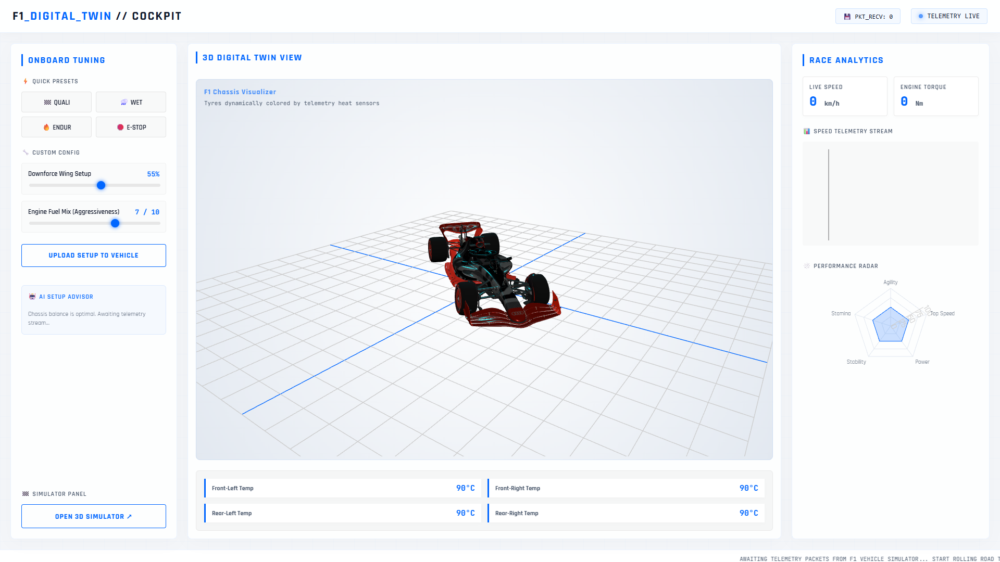
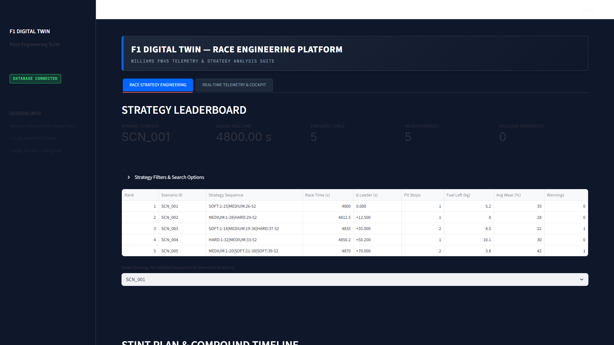
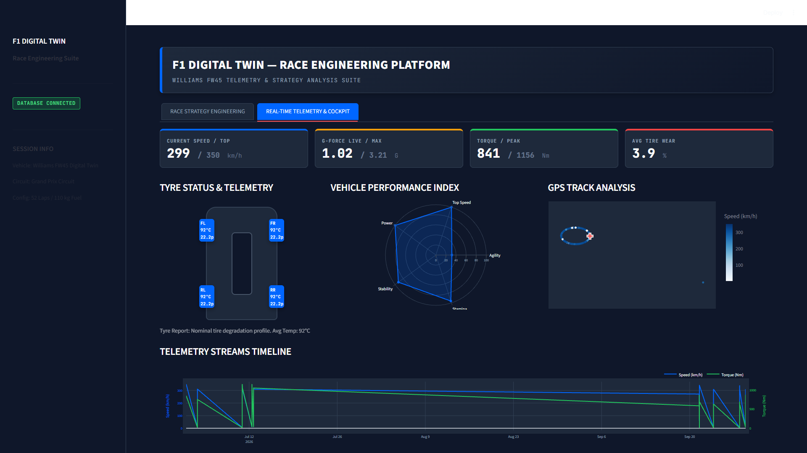
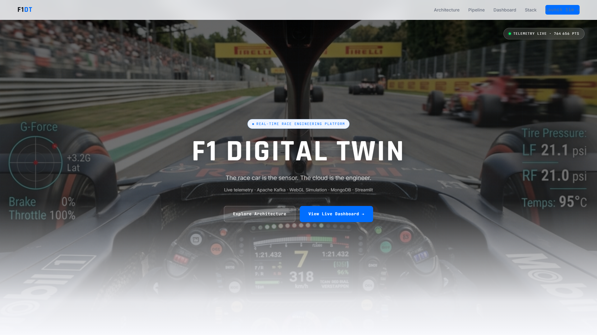
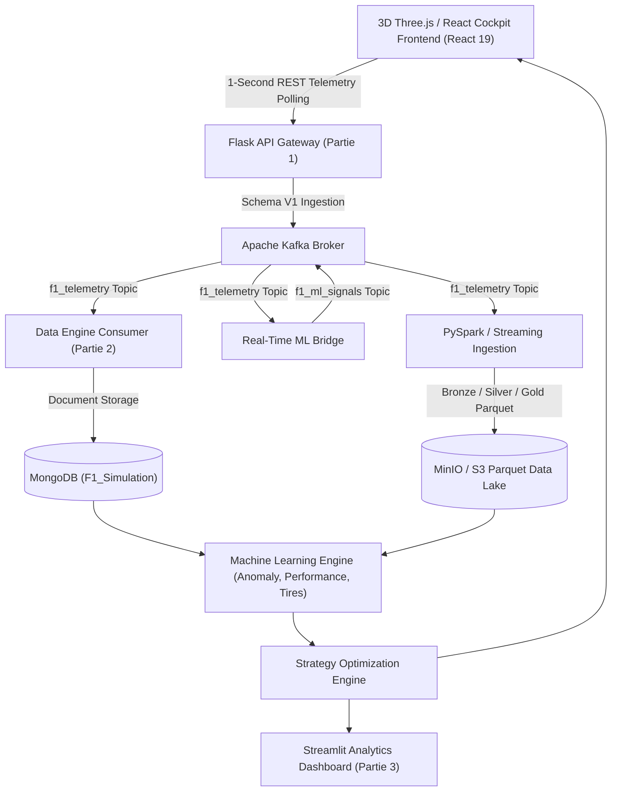

# F1 Digital Twin — Race Engineering Platform

An end-to-end Formula 1 Digital Twin and Race Engineering platform combining interactive 3D WebGL vehicle simulation, real-time telemetry streaming, multi-tier Parquet data lake architecture, machine learning inference, automated strategy optimization, and professional engineering dashboards.

---

## Overview

The **F1 Digital Twin — Race Engineering Platform** simulates real-time Formula 1 vehicle dynamics and processes high-frequency telemetry streams. The platform ingests telemetry via an API gateway, streams events through Apache Kafka, processes data into a multi-tier Parquet Data Lake (Bronze, Silver, Gold), trains and runs machine learning inference models (anomaly detection, lap time prediction, tire wear degradation), and executes a deterministic race strategy optimization engine.

Engineers and race strategists interact with the platform through a 3D Three.js/React Cockpit interface and a dedicated Streamlit Analytics Dashboard.

---

## Visual Showcase

### 3D Digital Twin Simulation

The interactive WebGL Digital Twin provides a real-time visualization of the simulated F1 vehicle, telemetry HUD, vehicle dynamics and environmental conditions.


### React 19 Race Engineering Cockpit

The production React 19 cockpit provides a real-time engineering interface for telemetry monitoring, tyre status and vehicle setup controls.



### Race Strategy Engineering Dashboard

The Streamlit strategy dashboard exposes deterministic strategy optimization, candidate ranking, stint allocation and race-time trade-offs.



### Real-Time Telemetry & Performance Analytics

The telemetry dashboard provides engineering KPIs, four-corner tyre diagnostics, vehicle performance analysis and GPS track visualization.



### End-to-End Race Trial Simulation

The end-to-end race trial simulation demonstrates real-time telemetry streaming, active lap timing, vehicle dynamics and strategy execution.



---

## 🎥 Project Demo

The end-to-end platform demonstration highlights the complete race engineering workflow across five integrated phases:
1. **3D WebGL Digital Twin Simulation** — Vehicle dynamics, wind tunnel testing, rolling road dyno & cockpit controls.
2. **Telemetry Ingestion & Pipeline** — Vehicle telemetry schema validation & event streaming.
3. **Streamlit Analytics & Diagnostics** — 4-corner tyre temperature/pressure tracking, radar performance index & GPS track visualization.
4. **Machine Learning Predictive Models** — XGBoost lap-time estimation, tyre wear degradation curves & Isolation Forest anomaly detection.
5. **Deterministic Strategy Optimizer (G.4.5)** — Lexicographic multi-objective ranking, stint timeline allocation & pit stop trade-off analysis.

### Video Demonstration
- 🎬 [▶ Watch the Web-Optimized Project Demo (24 MB MP4)](docs/demo/F1_Digital_Twin_Project_Demo_Optimized.mp4) — *Recommended for repository hosting & browser streaming*
- 📁 [▶ Master Archive Demo Video (107 MB MP4)](docs/demo/F1_Digital_Twin_Project_Demo.mp4) — *Full master recording*

*Note: You can download or stream the MP4 video directly from the `docs/demo/` directory.*

---

## Architecture



---

## Key Features

### Digital Twin & Simulation
- **3D Vehicle Rendering**: Interactive Three.js WebGL car model with real-time telemetry overlay.
- **Physics Engine**: Multi-variable physics calculations modeling aerodynamics (downforce, drag), powertrain (engine mix, torque), tire thermal behavior, and fuel mass consumption (~1.6 kg/lap).
- **Track & Environmental Conditions**: Simulation of dry, wet, and heavy rain weather conditions impacting grip levels and lap times.

### Real-Time Telemetry
- **API Gateway**: High-throughput Flask REST ingestion endpoint (`POST /telemetry`).
- **Schema V1 Validation**: Strict JSON schema verification using `jsonschema` ensuring structural payload integrity.
- **Security & Limits**: Configurable CORS policies, request body size limits (`MAX_CONTENT_LENGTH`), and log secret masking.

### Data Engineering
- **Message Broker**: Apache Kafka topics (`f1_telemetry` and `f1_ml_signals`) for real-time telemetry streaming.
- **Multi-Tier Data Lake**: Columnar Parquet storage organized into **Bronze** (raw events), **Silver** (cleaned and transformed data), and **Gold** (aggregated metrics) layers.
- **Incremental ETL Processing**: Streamlined incremental data transformers (`IncrementalTransformer`, `IncrementalGoldBuilder`) and PySpark structured streaming support.
- **Hybrid Storage**: Document storage in MongoDB for session metadata alongside MinIO/S3 object storage for Parquet files.

### Machine Learning
- **Anomaly Detection**: Isolation Forest (`sklearn.ensemble.IsolationForest`) and statistical baseline thresholding for detecting sensor spikes, aerodynamic loss, and powertrain anomalies.
- **Lap-Time Predictor**: Regression models (XGBoost, LightGBM, Random Forest, Ridge) predicting lap times based on fuel load, tire wear, and track evolution.
- **Tire Degradation Curves**: Compound-specific mathematical and empirical wear models (Linear, Polynomial, Exponential fit).
- **Real-Time ML Bridge**: High-performance consumer (`ml_bridge_consumer.py`) providing sub-millisecond inference over active telemetry streams.

### Strategy Optimization
- **Scenario Generator**: Multi-stint race scenario generation supporting up to 37,305 candidate strategy permutations for a 300-lap race.
- **Race Pace Simulator**: Deterministic stint lap-time simulator integrating fuel weight degradation, pit stop window constraints, and tire compound degradation curves.
- **Constraint Validator**: Strict enforcement of project-defined race and simulation constraints (minimum/maximum stint length, mandatory multi-compound selection, pit lane time loss).
- **Lexicographic Ranking**: Deterministic 6-tier strategy ranking prioritized by:
  1. Total Race Duration ASC (Primary)
  2. Pit Stop Count ASC (Secondary)
  3. Final Fuel Mass DESC (Tertiary)
  4. Average Final Tire Wear ASC (Quaternary)
  5. Canonical Key ASC (Alphabetical tie-breaker)
  6. Scenario ID ASC (Final deterministic fallback)

### Engineering Dashboards
- **Streamlit Analytics Dashboard**: Interactive stint timeline visualizer, compound degradation comparison, strategy leaderboard, and detailed scenario breakdown.
- **React Cockpit**: Production React 19 / Vite frontend rendering real-time vehicle telemetry widgets and strategy controls with 1-second polling.

### Production & CI/CD
- **Containerized Architecture**: Multi-stage Dockerfiles (`Dockerfile.api`, `Dockerfile.dashboard`, `Dockerfile.ml_bridge`, `Dockerfile.data_engine`) with non-root security execution (`USER f1user`, UID 1000).
- **Orchestration**: Unified production stack via `docker-compose.prod.yml`.
- **Automated CI/CD**: GitHub Actions workflow running PyTest regression test suite, React asset compilation, and Docker image build validation.

---

## Machine Learning

The machine learning subsystem is organized into modular packages under `code/ml/`:

| Module | Algorithm / Models | Purpose |
| :--- | :--- | :--- |
| **Anomaly Detection** (`code/ml/anomaly/`) | Isolation Forest, Baseline Thresholding | Detects anomalous telemetry events (sensor failures, speed anomalies, aerodynamic breakdown). |
| **Lap-Time Prediction** (`code/ml/performance/`) | XGBoost, LightGBM, Random Forest, Ridge | Models predicted lap performance as a function of fuel mass, tire wear, and engine mode. |
| **Tire Degradation** (`code/ml/tire_degradation/`) | Linear, Polynomial & Exponential Fit, Random Forest | Predicts per-lap tire wear percentages across Soft, Medium, and Hard compounds (Validated Global MAE = **0.0001**, $R^2$ = **0.9983**). |
| **Real-Time ML Bridge** (`code/streaming/ml_bridge_consumer.py`) | Stream Inference Engine | Consumes `f1_telemetry` Kafka messages, executes inference, and publishes signals to `f1_ml_signals`. |

---

## Strategy Engine

The Strategy Optimization Engine (`code/ml/strategy/`) evaluates optimal race pit stop strategies:

1. **Scenario Builder**: `ScenarioGenerator` generates candidate stint combinations based on pit stop count (1-stop, 2-stop, 3-stop) and compound allocations.
2. **Race Pace Simulator**: `StrategySimulator` executes lap time calculations for each stint, applying compound degradation models and fuel weight penalties (~1.6 kg/lap).
3. **Constraint Validator**: `ConstraintValidator` filters invalid strategies against project-defined race and simulation constraints (`ScenarioConstraints`).
4. **Lexicographic Optimizer**: `StrategyOptimizer` applies a deterministic 6-tier ranking key:
   1. `total_race_time_sec` ASC
   2. `pit_stop_count` ASC
   3. `final_fuel_kg` DESC
   4. `avg_final_tire_wear_pct` ASC
   5. `canonical_key` ASC
   6. `scenario_id` ASC
5. **Ranking & Dashboard Adapter**: `StrategyDashboardAdapter` formats strategy recommendations for Streamlit rendering.

---

## Technology Stack

| Category | Technologies / Libraries | Purpose |
| :--- | :--- | :--- |
| **Frontend** | React 19, Three.js, WebGL, Vite, Lucide React, HTML5/CSS3 | 3D Digital Twin visualization & Cockpit UI |
| **Backend API** | Python 3.10+, Flask 3.1.0, Gunicorn 23.0.0, `jsonschema` 4.23.0 | REST API gateway & telemetry validation |
| **Streaming & Messaging** | Apache Kafka (`kafka-python` 2.0.2), PySpark 3.5.1 | Telemetry streaming & signal processing |
| **Data Engineering & Lake** | PyArrow 18.1.0, Parquet, MinIO / AWS S3 (`boto3` 1.35.81) | Columnar Data Lake (Bronze/Silver/Gold) |
| **Machine Learning** | Scikit-learn 1.6.0, XGBoost 2.1.3, LightGBM 4.5.0, SciPy 1.14.1, Joblib 1.4.2 | Predictive ML & anomaly detection |
| **Database** | MongoDB (`pymongo` 4.10.1) | Document storage for telemetry events & sessions |
| **Visualization & Analytics** | Streamlit 1.41.0, Plotly 5.24.1, Matplotlib 3.10.0 | Interactive engineering dashboard & analytics |
| **DevOps & CI/CD** | Docker, Docker Compose, GitHub Actions, PyTest 9.0.3, `pytest-cov` | Multi-stage containerization & CI testing |

---

## Project Structure

```
F1_Data_Project/
├── .github/
│   └── workflows/
│       └── ci.yml                      # GitHub Actions CI workflow
├── code/
│   ├── partie1/                        # Web Simulation & Flask API Gateway
│   │   ├── app.py                      # Flask API server & /telemetry endpoint
│   │   ├── simulation.js               # 3D Three.js vehicle simulation logic
│   │   └── index.html                  # Main WebGL cockpit page
│   ├── partie2/                        # Data Engineering & Kafka Consumer
│   │   └── data_engine.py              # Kafka telemetry consumer -> MongoDB
│   ├── partie3/                        # Streamlit Analytics Dashboard
│   │   └── analytics_dashboard.py      # Streamlit engineering dashboard app
│   ├── partie4/                        # Production React Cockpit Frontend
│   │   ├── src/                        # React 19 components & UI
│   │   ├── package.json                # Frontend package manifest (React 19.2.7)
│   │   └── vite.config.js              # Vite build configuration
│   ├── etl/                            # Data Lake ETL Pipelines
│   │   ├── bronze/                     # Raw Parquet ingestion
│   │   ├── silver/                     # Data cleaning & quality rules
│   │   ├── gold/                       # Aggregated performance data
│   │   └── pipeline.py                 # Main ETL orchestrator
│   ├── ml/                             # Machine Learning & Strategy Modules
│   │   ├── anomaly/                    # Isolation Forest anomaly detection
│   │   ├── performance/                # XGBoost/LightGBM lap-time models
│   │   ├── tire_degradation/           # Tire wear prediction models
│   │   └── strategy/                   # Race Strategy Optimization Engine
│   ├── schema/                         # Schema V1 JSON payload validator
│   ├── storage/                        # MongoDB client & ingestion helpers
│   ├── streaming/                      # PySpark & Real-Time ML Bridge Consumer
│   ├── config.py                       # Centralized application configuration
│   └── logger.py                       # Structured logging & secret masking
├── tests/                              # Automated PyTest test suite (51 test files)
├── reports/                            # Phase technical reports (G.3 through G.6.1)
├── Dockerfile.api                      # Flask API multi-stage Dockerfile
├── Dockerfile.dashboard                # Streamlit Dashboard Dockerfile
├── Dockerfile.ml_bridge                # Real-Time ML Bridge Dockerfile
├── Dockerfile.data_engine              # Data Engine Kafka Consumer Dockerfile
├── docker-compose.prod.yml             # Production Docker Compose stack
├── requirements.txt                    # Python dependency manifest
└── README.md                           # Project documentation
```

---

## Installation

### Prerequisites
- **Python**: Version 3.10 or higher
- **Node.js**: Version 20 or higher (for React Cockpit frontend)
- **Docker Desktop**: Required for containerized execution and Kafka services

### Local Setup Instructions

1. **Clone the Repository**:
   ```bash
   git clone https://github.com/GJHamza/F1-Digital-Twin-Race-Engineering.git
   cd F1-Digital-Twin-Race-Engineering
   ```

2. **Create & Activate Python Virtual Environment**:
   ```powershell
   # Windows (PowerShell)
   python -m venv venv
   .\venv\Scripts\activate
   ```

3. **Install Python Dependencies**:
   ```bash
   pip install --upgrade pip
   pip install -r requirements.txt
   ```

4. **Configure Environment Variables**:
   ```powershell
   # Copy configuration template
   copy .env.example .env
   ```

5. **Install & Build React Cockpit Frontend**:
   ```bash
   cd code/partie4
   npm ci
   npm run build
   cd ../..
   ```

---

## Running the Project

### Option A: Production Docker Compose Stack (Recommended)
Start the complete containerized stack (Zookeeper, Kafka, MinIO, Flask API, Streamlit Dashboard, ML Bridge, Data Engine):
```bash
docker compose -f docker-compose.prod.yml up -d
```

### Option B: Local Python Execution

1. **Start Infrastructure Services (Kafka + Zookeeper)**:
   ```bash
   docker compose -f code/partie2/docker-compose.yml up -d
   ```

2. **Start Flask API Gateway**:
   ```bash
   $env:PYTHONPATH="code:."
   python code/partie1/app.py
   ```

3. **Start Real-Time Data Engine**:
   ```bash
   python code/partie2/data_engine.py
   ```

4. **Start Streamlit Analytics Dashboard**:
   ```bash
   python -m streamlit run code/partie3/analytics_dashboard.py
   ```

5. **Start Real-Time ML Bridge (Optional)**:
   ```bash
   python code/streaming/ml_bridge_consumer.py
   ```

### Service Access URLs

| Service | Local URL |
| :--- | :--- |
| **3D WebGL Digital Twin / API Gateway** | [http://localhost:5000](http://localhost:5000) |
| **Streamlit Analytics Dashboard** | [http://localhost:8501](http://localhost:8501) |
| **API Liveness Healthcheck** | [http://localhost:5000/health](http://localhost:5000/health) |

---

## Testing

The project maintains a comprehensive automated PyTest suite covering unit, integration, and scenario generation tests.

### Run PyTest Test Suite
Execute the full test suite from the repository root:
```bash
$env:PYTHONPATH="code:."
python -m pytest --ignore=code/partie4/node_modules
```

### Test Suite Baseline
- **Total Test Count**: 396 collected tests across 51 test files
- **Baseline Result**: **388 Passed, 8 Skipped** (0 Failures, 0 Errors)
- *Note: 8 integration tests are intentionally skipped when offline MinIO/Kafka services are not running.*

---

## CI/CD

Automated continuous integration is executed via GitHub Actions (`.github/workflows/ci.yml`):

1. **Run PyTest Test Baseline**: Executes full PyTest test suite on Python 3.10 (`ubuntu-latest`).
2. **Build React Cockpit Assets**: Installs dependencies (`npm ci`) and compiles frontend assets (`npm run build`) on Node.js 20.
3. **Validate Docker Image Builds**: Validates Docker image builds for `Dockerfile.api`, `Dockerfile.dashboard`, `Dockerfile.ml_bridge`, and `Dockerfile.data_engine`.

---

## Engineering Results

| Category / Metric | Verified Value | Source / Verification |
| :--- | :--- | :--- |
| **Automated Test Baseline** | 396 Collected (388 Passed, 8 Skipped, 0 Failures) | PyTest full test execution suite |
| **Tire Degradation ML Model** | Validation/Test Global MAE = **0.0001**, $R^2$ = **0.9983** | `reports/g4_4/PHASE_G4_4_REPORT.md` |
| **Strategy Scenario Permutations** | 37,305 candidate scenarios generated (300-lap race) | `tests/test_strategy_scenarios.py` |
| **ML Inference Speed** | Sub-millisecond per event | `code/streaming/ml_bridge_consumer.py` |
| **Frontend Production Build Time** | ~2.4 seconds | Vite production asset build |
| **Data Lake Storage Structure** | Bronze / Silver / Gold Parquet layers | `code/etl/` pipeline modules |

---

## Assumptions & Limitations

- **Simulation Physics**: Aerodynamics, downforce, fuel mass reduction (~1.6 kg/lap), and tire degradation curves are mathematical model approximations designed for real-time digital twin execution.
- **Offline Integration Tests**: Data lake S3/MinIO integration test cases auto-skip when local S3/MinIO services are inactive.
- **Telemetry Streaming Mode**: The React web cockpit interface communicates with the Flask API gateway via 1-second REST HTTP polling (`setInterval(fetchTelemetry, 1000)`).

---

## Security

Security hardening features include:
- **Environment Variables**: Sensitive configuration parameters are managed via `.env` loaded centrally through `code/config.py`.
- **Secret Redaction**: Structured logging includes `SecretMaskingFilter` to sanitize connection strings, URIs, and credentials in application logs.
- **CORS Restrictions**: Configurable allowed origin lists (`CORS_ORIGINS`).
- **Payload Validation**: Strict range and type checks on incoming telemetry payloads via `schema/schema_validator.py`.
- **Container Hardening**: Docker images execute under non-root user privileges (`USER f1user`, UID 1000).

---

## License

This project is licensed under the [MIT License](LICENSE).

---

## Author

**Hamza Gourja**  
*Data Science Engineering Student @ SUPMTI*  
GitHub: [https://github.com/GJHamza/F1-Digital-Twin-Race-Engineering](https://github.com/GJHamza/F1-Digital-Twin-Race-Engineering)
