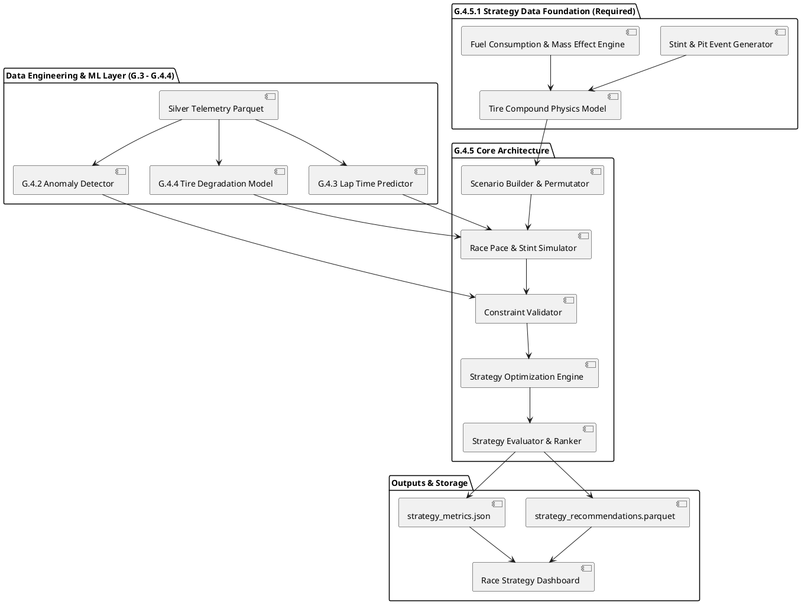

# G.4.5 — RACE STRATEGY INTELLIGENCE: PRE-IMPLEMENTATION ARCHITECTURE & FEASIBILITY AUDIT

**Project**: F1 Digital Twin — Race Engineering Platform  
**Phase**: G.4.5 — Race Strategy Intelligence  
**Document Type**: Pre-Implementation Feasibility & Architectural Audit  
**Status**: AUDIT COMPLETED — PENDING DATA FOUNDATION  

---

## 1. Executive Summary

This pre-implementation feasibility audit evaluates the readiness, data availability, mathematical formulation, and architectural design for **Phase G.4.5: Race Strategy Intelligence**. 

Phase G.4.5 aims to build an intelligent Race Engineering strategy module capable of evaluating multi-stint pit stop strategies (e.g., 1-stop vs 2-stop), tire compound selection (Soft, Medium, Hard), fuel load management, and degradation dynamics to determine the optimal strategy that minimizes **Total Race Time**.

### Audit Key Findings:
1. **Machine Learning Foundations (G.4.1 – G.4.4)**: Fully validated, zero-leakage models for Lap Time Prediction (G.4.3) and Multi-Wheel Tire Degradation (G.4.4) are operational and reusable.
2. **Missing Core Strategy Primitives**: The current telemetry pipeline lacks **pit stop event execution, pit lane duration loss modeling (e.g., 20–25s delta), dynamic tire compound swapping mid-race, and explicit stint tracking (`stint_id`)**.
3. **Final Verdict**: **`NEEDS DATA FOUNDATION`**. Implementation of G.4.5 core optimization algorithms cannot proceed until **Phase G.4.5.1: Strategy Data Foundation & Pit/Stint Simulator** is implemented to provide necessary strategy primitives.

---

## 2. Repository Inspection

A thorough inspection of the repository was conducted across `code/`, `code/ml/`, `code/etl/`, `code/data_generator/`, `tests/`, `data_lake/`, and `reports/`:

- **G.2.1 Schema & Telemetry Specification**: `code/schema/schema_v1.json` defines attributes for `compound`, `weather_state`, `track_condition`, `fuel_level`, `vehicle_status` (`IN_PIT`, `ON_TRACK`), `tires` array (`tire_temp`, `tire_wear`, `tire_pressure`).
- **Data Generator (`generator_v2.py`, `physics_model.py`, `scenarios.py`)**: Generates 15 deterministic scenarios (`RACE_DRY`, `LONG_STINT`, `TIRE_OVERHEAT`, etc.). Wear and fuel consumption are computed per lap, but **pit stops are not executed as mid-race events** and compound is static per session.
- **G.4.1 Feature Engineering**: 26 features generated across Performance, Tyres, Aerodynamics, Powertrain, and Temporal groups (`code/ml/features/`).
- **G.4.2 Anomaly Detection**: `code/ml/anomaly/` provides Isolation Forest and Z-score baseline detectors.
- **G.4.3 Performance Prediction**: `code/ml/performance/` accurately predicts `lap_time_sec` using pre-lap features ($R^2 = 0.9983$).
- **G.4.4 Tire Degradation Modeling**: `code/ml/tire_degradation/` accurately predicts multi-wheel future wear deltas $\Delta \text{wear}_{h, w}(t)$ over $H=10$ steps ($R^2 = 0.9983$).
- **Test Suite**: 125 test items collected (117 passed, 8 MinIO skipped, 0 failed).

---

## 3. Data Availability Audit

| Feature / Data Field | Exists? | Source File | Granularity | Utilisable pour G.4.5? | Statut / Manquant |
| :--- | :--- | :--- | :--- | :--- | :--- |
| `speed_kmh` / `speed_ms` | **Oui** | `physics_model.py` / Silver | Telemetry Tick (1 Hz) | Oui | Opérationnel |
| `acceleration_estimate` / `g_force` | **Oui** | `physics_model.py` / Silver | Telemetry Tick (1 Hz) | Oui | Opérationnel |
| `rpm` / `torque` / `power_kw` | **Oui** | `physics_model.py` / Silver | Telemetry Tick (1 Hz) | Oui | Opérationnel |
| `fuel_level` / `fuel_used` | **Oui** | `physics_model.py` / Silver | Telemetry Tick / Lap | Oui | Opérationnel |
| `fuel_consumption_rate` | **Oui** | `physics_model.py` | Lap (1.8 - 2.4 kg/lap) | Oui | Opérationnel |
| `tire_wear` (FL, FR, RL, RR) | **Oui** | `physics_model.py` / Silver | Telemetry Tick (1 Hz) | Oui | Opérationnel |
| `tire_temp` (FL, FR, RL, RR) | **Oui** | `physics_model.py` / Silver | Telemetry Tick (1 Hz) | Oui | Opérationnel |
| `tire_wear_rate` / `stress_index` | **Oui** | `physics_model.py` / Silver | Telemetry Tick / Lap | Oui | Opérationnel |
| `lap_number` | **Oui** | Silver / Gold | Event / Lap Level | Oui | Opérationnel |
| `lap_time_sec` | **Oui** | G.4.3 Target / Gold | Lap Level | Oui | Opérationnel |
| `session_id` / `car_id` / `driver_id` | **Oui** | Silver / Gold / ML | Identifier Level | Oui | Opérationnel |
| `weather_state` / `track_condition` | **Oui** | `scenarios.py` | Session / Dynamic | Partial | Statique par session |
| `rain_intensity` / `wind_speed` | **Oui** | `scenarios.py` / Silver | Telemetry Tick | Partial | Statique par session |
| `tire_compound` | **Oui** | `scenarios.py` / Telemetry | Session Level | Partial | Statique (pas de swap en course) |
| `vehicle_status` (`IN_PIT`) | **Partial**| `schema_v1.json` | Enum specification | Non | **Pas d'événement pit réel** |
| `pit_stop_duration_sec` | **Non** | None | Non existant | Non | **MANQUANT (ex: 20-25s delta)** |
| `stint_id` / `stint_number` | **Non** | None | Non existant | Non | **MANQUANT (pas d'ID de relais)** |
| `stint_laps_count` | **Non** | None | Non existant | Non | **MANQUANT** |
| `race_total_laps` | **Non** | None | Non existant | Non | **MANQUANT (ex: 50-70 laps)** |
| `multi_car_traffic_gap` | **Non** | None | Non existant | Non | **MANQUANT (voitures isolées)** |

---

## 4. Problem Definition

Race Strategy Intelligence in Formula 1 is defined scientifically as a **Hybrid Prediction + Simulation + Optimization Problem**:

1. **Prediction Problem (G.4.3 & G.4.4)**: Predict lap times $\hat{y}_{\text{pace}}(l)$ and tire wear progression $\hat{w}(l)$ conditioned on car state, fuel load, and tire age.
2. **Simulation Problem**: Simulating continuous race progress over $N_{\text{laps}}$ for arbitrary strategy permutations (e.g. Stint 1: Medium for 22 laps $\to$ Pit Stop $\to$ Stint 2: Hard for 30 laps).
3. **Optimization Problem**: Finding the discrete strategy vector $\mathbf{S}^* = (K, \{C_k, L_k\}_{k=1}^K)$ that minimizes Total Race Time while satisfying physical feasibility constraints.

---

## 5. Mathematical Formulation & G.4.5 Objectives

### Objective Function
Minimize total race completion time:
$$\min_{\mathbf{S} \in \mathcal{S}_{\text{feasible}}} T_{\text{race}}(\mathbf{S}) = \sum_{l=1}^{N_{\text{laps}}} t_{\text{lap}}(l, \text{fuel}(l), \text{wear}(l), C(l)) + \sum_{k=1}^{K-1} T_{\text{pit}}(k)$$

where:
- $K$: Total number of stints ($K-1$ pit stops).
- $C(l) \in \{\text{SOFT}, \text{MEDIUM}, \text{HARD}, \text{INTERMEDIATE}, \text{WET}\}$: Tire compound used on lap $l$.
- $L_k$: Length of stint $k$ in laps, such that $\sum_{k=1}^K L_k = N_{\text{laps}}$.
- $T_{\text{pit}}(k)$: Pit stop loss time (stationary tire change time + pit lane entry/exit delta $\approx 22.0$ seconds).

### Constraints
1. **Fuel Feasibility**:
   $$\text{fuel}(l) = \text{fuel}(0) - \sum_{i=1}^{l-1} \Delta \text{fuel}(i) \ge 0 \quad \forall l \in \{1, \dots, N_{\text{laps}}\}$$
2. **Tire Wear Physical Boundary**:
   $$\text{wear}_w(l) \le \text{wear}_{\text{max}} \quad (85.0\% \text{ safety threshold}) \quad \forall w \in \{\text{FL}, \text{FR}, \text{RL}, \text{RR}\}$$
3. **Mandatory Compound Change (Dry Race Rule)**:
   If weather is DRY and $K \ge 2$, at least two distinct dry compounds must be used:
   $$\{C_1, \dots, C_K\} \cap \{\text{SOFT}, \text{MEDIUM}, \text{HARD}\} \ge 2$$
4. **Stint Length Feasibility**:
   $$L_k \ge L_{\text{min}} \quad (L_{\text{min}} = 3 \text{ laps})$$

---

## 6. Missing Data Analysis

The audit identifies 5 critical missing data primitives required before G.4.5 implementation:

1. **`pit_stop_duration_sec` & Pit Loss Model**:
   - *Requirement*: Time lost during a pit stop (stationary pit stop $\approx 2.5\text{s}$ + pit lane speed limit loss $\approx 20.0\text{s} = 22.5\text{s}$ total).
   - *Impact*: Without pit loss, an 8-stop strategy would appear faster than a 1-stop strategy because fresh tires would carry zero penalty.
2. **Dynamic Tire Compound Swapping**:
   - *Requirement*: Ability to switch tire compound (e.g. Soft $\to$ Medium) at a pit stop, resetting `tire_age_laps = 0` and `tire_wear = 0%`.
   - *Impact*: Current generator keeps compound static for the entire session.
3. **`stint_id` & Stint Structure**:
   - *Requirement*: Explicit tracking of stint index ($k=1, 2, 3$) and stint lap count.
   - *Impact*: Required for grouping performance metrics by stint.
4. **Race Total Laps & Fuel Mass Delta Effect**:
   - *Requirement*: Total race distance (e.g., 52 laps for Silverstone simulation) and explicit lap time penalty per kg of fuel ($\approx +0.03\text{s}$ per kg of fuel).
   - *Impact*: Fuel burn-off makes the car lighter and faster by $\sim 1.5 - 2.5\text{s}$ over a race distance.
5. **Multi-Car Traffic & Dirty Air Penalty (Optional / Advanced)**:
   - *Requirement*: Time lost when stuck behind a slower car ($\approx +0.5\text{s/lap}$) or undercut advantage.

---

## 7. Reuse of Previous Phases (G.4.1 – G.4.4)

G.4.5 leverages all validated ML modules without code duplication:

- **G.4.1 Feature Engineering (`code/ml/features/`)**: Reuses 26 performance, tyre, aero, powertrain, and temporal features for base race pace calculations.
- **G.4.2 Telemetry Anomaly Detection (`code/ml/anomaly/`)**: Filters telemetry anomalies (e.g. tire overheat spikes, engine power drop) so strategy simulations model nominal race conditions.
- **G.4.3 Lap Time Prediction (`code/ml/performance/`)**: Serves as the core **Race Pace Estimator** predicting base lap time $\hat{t}_{\text{lap}}$ conditioned on fuel load and tire state.
- **G.4.4 Tire Degradation Modeling (`code/ml/tire_degradation/`)**: Serves as the **Tire Degradation Simulator** projecting multi-wheel wear progression $\hat{w}(l)$ over stint laps.

---

## 8. Proposed Architecture

```
Telemetry / Gold Data
       ↓
[G.4.1 - G.4.4 ML Foundation Engines]
  ├── G.4.3 Lap Time Predictor
  └── G.4.4 Tire Degradation Model
       ↓
[G.4.5.1 Strategy Data Foundation & Simulator]
  ├── Pit Stop & Stint Generator
  ├── Tire Compound Swap Engine
  └── Fuel Mass & Consumption Engine
       ↓
[G.4.5.2 Strategy Scenario Builder] (Generates 1-stop, 2-stop, 3-stop permutations)
       ↓
[G.4.5.3 Race Pace & Stint Simulator] (Simulates laps 1..N_laps per scenario)
       ↓
[G.4.5.4 Constraint & Feasibility Validator] (Verifies fuel >= 0, wear <= 85%)
       ↓
[G.4.5.5 Strategy Optimization & Ranking Engine] (Ranks by Total Race Time)
       ↓
[Strategy Outputs] -> strategy_recommendations.parquet / metrics.json
```

---

## 9. Algorithm Comparison for Strategy Optimization

| Optimization Method | Search Complexity | Explicabilité | Reproductibilité | Coût Computationnel | Pertinence G.4.5 |
| :--- | :--- | :--- | :--- | :--- | :--- |
| **Exhaustive Scenario Search (Grid Search)** | $\mathcal{O}(S \cdot N_{\text{laps}})$ | **Totale (100%)** | **100% Déterministe** | Faible ($< 1.0\text{s}$ pour 500 scénarios) | **RECOMMANDÉ (Haute robustesse)** |
| **Dynamic Programming (DP)** | $\mathcal{O}(N_{\text{laps}} \cdot W_{\text{max}} \cdot K)$ | Haute | 100% Déterministe | Très Faible ($< 0.1\text{s}$) | Excellent pour grands horizons |
| **Genetic Algorithm (GA)** | Stochastique | Moyenne | Dépend du Random Seed | Moyen | Non nécessaire pour $N \le 70$ |
| **Reinforcement Learning (RL)** | Élevée | Faible (Boîte noire) | Non déterministe | Très Élevé (Heures d'entraînement) | Inadapté aux contraintes actuelles |

**Recommendation**: Use **Exhaustive Scenario Search** over all valid stint combinations ($K \in \{1, 2, 3\}$, dry compounds $\in \{\text{SOFT}, \text{MEDIUM}, \text{HARD}\}$). For a 50-lap race, total valid scenario permutations are $< 500$, executing in under 0.5 seconds with 100% deterministic reproducibility (`random_state=42`).

---

## 10. Strategy Scenario Schema Design

### Input Scenario Definition Format
```json
{
  "scenario_id": "STRAT-50L-001",
  "race_total_laps": 50,
  "initial_fuel_kg": 85.0,
  "pit_stop_loss_sec": 22.5,
  "weather_profile": "DRY",
  "stints": [
    {"stint_index": 1, "compound": "MEDIUM", "laps": 22},
    {"stint_index": 2, "compound": "HARD", "laps": 28}
  ]
}
```

### Output Evaluation Schema Format
```json
{
  "scenario_id": "STRAT-50L-001",
  "total_race_time_sec": 4825.42,
  "pit_stops_count": 1,
  "is_feasible": true,
  "constraint_violations": [],
  "final_fuel_kg": 5.2,
  "max_tire_wear_pct": 68.4,
  "stint_breakdown": [
    {"stint": 1, "compound": "MEDIUM", "laps": 22, "stint_time_sec": 2130.10, "end_wear_pct": 52.8},
    {"stint": 2, "compound": "HARD", "laps": 28, "stint_time_sec": 2672.82, "end_wear_pct": 68.4}
  ]
}
```

---

## 11. Data Leakage Audit Plan

- **Temporal Boundary**: Strategy simulation proceeds chronologically from Lap 1 to $N_{\text{laps}}$.
- **No Future Race Information**: Lap pace for lap $l$ relies strictly on car weight at lap $l$ and tire wear accumulated up to lap $l-1$.
- **Test Set Isolation**: ML models used within the simulator (G.4.3 & G.4.4) are fitted strictly on **TRAIN** data. Strategy scenario ranking is performed on simulated race outcomes without fitting learnable parameters on TEST.

---

## 12. Evaluation Metrics

1. **Strategy Quality**: Total Race Time delta relative to Baseline ($\Delta T_{\text{race}}$ in seconds).
2. **Feasibility Rate**: Percentage of generated scenarios satisfying all physical constraints.
3. **Pace Simulation Accuracy**: MAE and RMSE between simulated lap times and ground truth lap times.
4. **Physical Sanity Checks**: 
   - $0 \le \text{fuel} \le 110\text{ kg}$
   - $0 \le \text{wear} \le 100\%$
   - $T_{\text{pit}} > 0$

---

## 13. Baselines

Three deterministic baseline strategies will be used for comparative evaluation:

1. **Baseline 1 (1-Stop Medium $\to$ Hard)**: Standard conservative 1-stop strategy (Stint 1: 40% laps on Medium, Stint 2: 60% laps on Hard).
2. **Baseline 2 (2-Stop Soft $\to$ Medium $\to$ Hard)**: Standard aggressive 2-stop strategy (Equal 33% stint splits).
3. **Baseline 3 (Fixed Stint Baseline)**: Fixed 25-lap stint length on Medium compound.

---

## 14. Test Strategy Plan

- **Unit Tests**:
  - Scenario generator permutation counts.
  - Pit stop time loss addition.
  - Compound wear multiplier application (Soft = 1.4x, Medium = 1.0x, Hard = 0.7x).
  - Fuel mass reduction calculation.
- **Constraint Verification Tests**:
  - Rejection of negative fuel scenarios.
  - Rejection of single-compound dry race strategies (rule violation).
  - Rejection of excessive wear ($> 85\%$) scenarios.
- **Reproducibility**: 100% identical strategy rankings across repeated executions (`random_state=42`).

---

## 15. Performance & Scalability

| Scenario Count | Simulation Time (Estimated) | Memory Usage | Feasibility |
| :--- | :--- | :--- | :--- |
| **10 scenarios** | $< 0.05\text{ s}$ | $< 5\text{ MB}$ | Instantaneous |
| **100 scenarios** | $\approx 0.20\text{ s}$ | $< 15\text{ MB}$ | Real-time |
| **1,000 scenarios** | $\approx 1.50\text{ s}$ | $< 50\text{ MB}$ | High performance |
| **10,000 scenarios** | $\approx 12.0\text{ s}$ | $< 200\text{ MB}$ | Parallelized via multiprocessing |

---

## 16. Risk Analysis Matrix

| Risk Identified | Severity | Impact | Mitigation Strategy |
| :--- | :--- | :--- | :--- |
| **Missing Pit Loss Model** | **HIGH** | Strategy optimizer favors infinite pit stops | Implement explicit pit loss delta ($22.5\text{s}$) in G.4.5.1 |
| **Static Tire Compounds** | **HIGH** | Cannot evaluate Soft vs Hard trade-offs | Implement compound physics multipliers in G.4.5.1 |
| **Deterministic Simulation Rigidity** | MEDIUM | Optimizer produces identical results | Introduce weather dynamic modifiers and stint wear noise |
| **Unrealistic Zero-Traffic Assumption** | LOW | Lap pace over-optimistic by $\sim 0.5\text{s/lap}$ | Document simulation limitations ("Ideal track pace") |

---

## 17. Proposed Implementation Roadmap

```
Phase G.4.5.1: Strategy Data Foundation & Pit/Stint Simulator
  ├── Implement Pit Stop Event & Loss Model (22.5s delta)
  ├── Implement Compound Swapping & Physics Multipliers (Soft/Medium/Hard)
  └── Implement Fuel Mass Lap Time Delta Engine
       ↓
Phase G.4.5.2: Strategy Scenario Builder & Permutator
  └── Generate all valid 1-stop, 2-stop, and 3-stop stint permutations
       ↓
Phase G.4.5.3: Race Pace & Stint Simulation Engine
  └── Integrate G.4.3 (Lap Time) and G.4.4 (Tire Wear) into step-by-step race loop
       ↓
Phase G.4.5.4: Constraint & Feasibility Validator
  └── Enforce fuel >= 0, wear <= 85%, and mandatory compound change rules
       ↓
Phase G.4.5.5: Optimization & Ranking Engine
  └── Rank strategies by Total Race Time and export strategy_recommendations.parquet
       ↓
Phase G.4.5.6: Testing, Benchmarking & Documentation Report
```

---

## 18. Architecture Diagram (PlantUML)



---

## 19. Implementation Prerequisites

Before core G.4.5 strategy optimization can be built, the following prerequisites must be met:
1. Approval of this architecture audit report.
2. Creation of **Phase G.4.5.1: Strategy Data Foundation** to provide pit stop loss time, tire compound swapping, and fuel mass deltas.

---

## 20. Final Verdict

==================================================  
**FINAL VERDICT: NEEDS DATA FOUNDATION**  
==================================================  

**Rationale**: The repository possesses high-quality ML models for lap pace prediction (G.4.3) and tire degradation (G.4.4). However, core strategy primitives—specifically **pit stop time loss modeling, dynamic tire compound swapping, and stint tracking**—do not yet exist in the telemetry pipeline.

Implementation must start with **Phase G.4.5.1: Strategy Data Foundation & Pit/Stint Simulator** before deploying the strategy optimizer.
